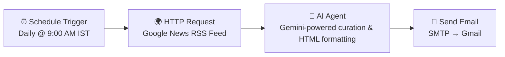

# 🌐 AI Tech News Automation — n8n Workflow

> An autonomous n8n workflow that scans global tech news every morning, uses a Gemini-powered AI agent to curate the top 10 most viral stories involving major tech leaders, and delivers a premium, styled HTML briefing straight to your inbox — fully unattended.


---

## 📬 What This Does

Every day at **9:00 AM IST**, this workflow runs completely on its own:

1. Pulls the latest global tech headlines from Google News (filtered for major tech leaders and AI developments)
2. Feeds the raw feed to a **Gemini-powered AI Agent** that identifies the **top 10 most viral, high-impact stories**
3. Formats them into a **premium, newsletter-style HTML email** — with dynamic highlight banners for breaking/critical news
4. Sends the finished briefing directly to Gmail via SMTP

No manual curation. No copy-pasting links. No opening ten browser tabs before breakfast.

---

## ✨ Features

- **🕘 Fully Scheduled** — runs automatically once a day, zero manual trigger required
- **🧠 AI-Curated, Not Just Aggregated** — the agent doesn't just list headlines, it selects the *top 10 by impact*, focused on major tech giants, founders, and CEOs
- **🔗 Hyperlink Integrity Safeguards** — the agent prompt enforces character-for-character extraction of source URLs from Google News' redirect-wrapped links, preventing broken or truncated links in the final email
- **🚨 Dynamic Visual Prioritization** — critical stories (executive shakeups, major AI model launches, multi-billion dollar acquisitions, regulatory milestones) are automatically rendered with a distinct highlighted banner style, separating them from routine updates
- **🎨 Premium Email Design** — clean, responsive inline-CSS HTML template built for Gmail rendering, not a plain-text digest
- **📤 Zero-Touch Delivery** — sent automatically via SMTP straight to an inbox

---

## 🏗️ Architecture



| Node | Role |
|---|---|
| **Schedule Trigger** | Fires the workflow once daily at a fixed hour (Asia/Kolkata timezone) |
| **HTTP Request** | Queries Google News RSS for tech/AI leadership news (Elon Musk, Sundar Pichai, Satya Nadella, and other major figures) |
| **AI Agent** | LangChain-based n8n agent powered by Google Gemini; parses the raw feed, ranks top 10 stories, extracts clean source URLs, and outputs styled HTML |
| **Send an Email** | Delivers the final HTML briefing via SMTP to the configured recipient |

---

## 🛠️ Tech Stack

- **n8n** — workflow orchestration
- **Google Gemini API** (via `@n8n/n8n-nodes-langchain`) — AI curation and content generation
- **Google News RSS** — raw data source
- **SMTP** — email delivery
- **Inline HTML/CSS** — newsletter templating (no external stylesheet, Gmail-safe)

---

## ⚙️ Setup & Installation

1. **Import the workflow**
   - In your n8n instance, go to **Workflows → Import from File**
   - Select `AI_Tech_News_Automation.json` from this repo

2. **Add credentials**
   - **Google Gemini (PaLM) API** — connect your Gemini API key under the *Google Gemini Chat Model* node
   - **SMTP** — connect your email provider's SMTP credentials under the *Send an Email* node

3. **Configure the email fields**
   - In the *Send an Email* node, replace `YOUR_EMAIL@gmail.com` in both **From** and **To** fields with your actual address

4. **Adjust the schedule (optional)**
   - Default: runs daily at **9:00 AM (Asia/Kolkata)**
   - Change the hour in the *Schedule Trigger* node to match your timezone/preference

5. **Customize the news query (optional)**
   - The *HTTP Request* node queries Google News for: `AI Elon Musk Sundar Pichai Satya Nadella`
   - Edit the URL query string to track different keywords, companies, or people

6. **Activate the workflow**
   - Toggle the workflow to **Active** in n8n — it will now run unattended on schedule

---

## 📸 Sample Output

*(Add a screenshot or GIF of a received email briefing here, e.g.)*

```

```

> 💡 Tip: A short screen recording showing the workflow trigger → generated email in Gmail makes a great addition here or linked as a demo video.

---

## 🔮 Possible Future Improvements

- Multi-recipient distribution list
- Slack/Discord delivery channel as an alternative to email
- Topic-based filtering (e.g., separate briefings for AI research vs. corporate news)
- Archive of past briefings stored in a database for trend tracking

---

## 👤 Author

**Vasanth Kumar R**
🔗 [GitHub](https://github.com/rvasanthkumar73-dev) · [LinkedIn](https://linkedin.com/in/vasanth-kumar-r-global)

---

## 📄 License

This project is open for personal and educational use. Feel free to fork and adapt it for your own briefing needs.
